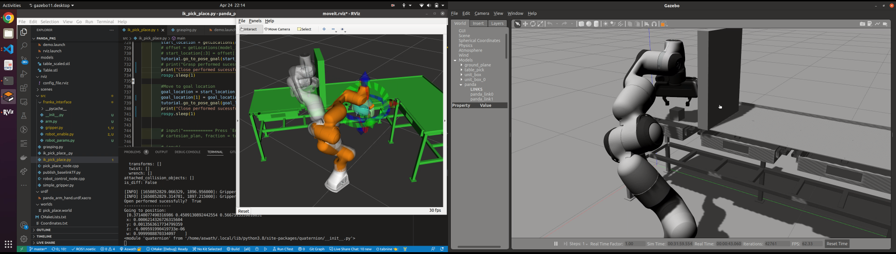

# Project 4 
Authors:
```
- Name: Aswath Muthuselvam 
- UID: 118286204
```
```
- Name: Gokul Hari
- UID: 117430646
```
- Course: ENPM 661 - Planning for Autonomous Robots


## Results:

### Images:


### Youtube video:
Youtube video of grasping box object, planning around obstacle and placing the object is shown - 
[link](https://youtu.be/KOL3YUmGwpU).

## Steps to install dependancies:
```
# install move it
rosdep update sudo apt update
sudo apt dist-upgrade

sudo apt install ros-noetic-catkin python3-catkin-tools

sudo apt install ros-noetic-moveit

# clone panda robot and move it tutorials in catkin workspace
cd <~>/catkin_ws/src

git clone https://github.com/ros-planning/moveit_tutorials.git -b master

git clone https://github.com/ros-planning/panda_moveit_config.git -b noetic-devel
cd ~/ws_moveit/src

## incase of error - update the ros--latest.list
sudo sh -c 'echo "deb http://packages.ros.org/ros-testing/ubuntu $(lsb_release -sc) main" > /etc/apt/sources.list.d/ros-latest.list' 
sudo apt update

# install the packages that we cloned and run catkin make
rosdep install -y --from-paths . --ignore-src --rosdistro noetic

cd <~>/catkin_ws/
catkin_make

source devel/setup.bash

```

Steps to run:
```
roslaunch panda_moveit_config demo_gazebo.launch

chmod +x  catkin_ws/src/panda_pkg/src/

python3 catkin_ws/src/panda_pkg/src/ik_pick_place.py

```
